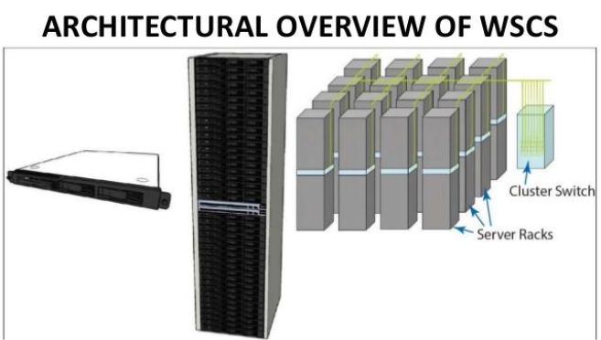

# Computer Architecture notes

collect and note by : JingShing

## Chapter 1

## Dialog目錄

[1.1 介紹](#1-1-Abstraction)

[1.2 計算機架構中的八大理念](#1.2計算機架構中的八大理念)

1.3 你的程式之下

1.4 覆蓋之下

1.5 建構處理器與記憶體的技術

1.6 效能

1.7 功耗障壁

1.8 巨變：由單處理器轉移至多處理器

1.9 實例：測試Intel core i7

1.10 謬誤與陷阱

### 1-1 Abstraction

* 計算機抽象化(Abstraction)
  * 以精要的形式來表達計算機的內涵、概念、特質、屬性或意義等，這個從計算機本身找出這個精要的形式的過程就是計算機抽象化。

* 計算機是極為快速變化的資訊科技工業中的產物

  * 如果運輸業有計算機工業的進展速度，今天我們將大約可以花幾分錢以一秒從紐約到倫敦。

  * 這個不尋常的工業以令人驚異的速度接納創意

### 計算應用的種類與它們的特性

大體而言，計算機被運用在三個不同種類的應用：

* 個人型計算機(Personal computers, PCs)

  * 強調以<u>**低成本**</u>提供單一使用者不錯的效能並能執行其他公司的軟體

* 伺服器(servers)

  是昔日大型主機、迷你計算機及超級電腦的現代版，通常經由網路來使用

  * 提供計算及輸出入容量上更大的擴充性
  * 也強調可靠度
  * Range from small servers to building sized

* 嵌入式計算機(embedded computers)

  在應用與效能的範圍最廣

  * 設計來執行單一應用或一組相關的應用，該等應用一般與硬體整合在一起，以單一系統型態呈現

  * 大部分使用者從不知道他們正在使用這類計算機通常有其獨特的應用需求以及最低效能和嚴格的成本與功耗限制

  * 通常更不能容忍失效

  * 經由簡單化或冗餘(redundancy)技術來達成

  > 冗餘(redundancy) : 利用多個 mcu 做溝通，作為備用
  > mcu : memory + cpu + io
  >
  > examples : 車載電腦、物聯網

### 進入後個人電腦時代

* 個人行動裝置(personal mobile device, PMD)由電池驅動、無線聯線至網際網路且一般售價為數百美元

  * 和個人電腦一樣，使用者可於其上執行可下載的軟體(“apps”)
  * 可能使用觸控螢幕甚或語言輸入

* 庫房規模計算機(Warehouse Scale Computers, WSCs)

  * Scalable可擴充

  * Distributed可分散

  * Cost efficiency

    > 單一硬盤損毀時可還原資料，資料會備份到多個硬盤

  ​	

  雲端計算(Cloud Computing)

  * 軟體寫作者常常會將他們的應用程式一部分執行於個人行動裝置上而一部分執行於雲端

  > 相較於雲端計算，本地的計算稱為邊緣計算(local)。

  ### 本教科書中內容

  * 在1960及1970年代，計算機的效能主要受限於其記憶體的大小
  * 現在重視效能的程式師需要瞭解，處理器的平行本質以及記憶體的階層性本質
    * 程式師於是必須增加他們的計算機組織知識
  * 本書能回答以下問題：
    * 以高階語言如C 或Java 所寫的程式如何被翻譯成硬體的語言，以及硬體如何執行這個硬體語言的程式？
  * 硬體與軟體的介面與關聯是什麼，以及軟體如何指使硬體來執行所需的功能？
  * 什麼因素決定程式的效能，以及程式如何可改善其效能？
  * 硬體設計師可用以改善效能的技術有哪些？
  * 最近由循序處理轉為平行處理的理由以及結果是什麼？
  * 自從第一台商用計算機在1951 年面世以來，計算機架構師提出過哪些奠定現代計算基礎的大理念？

  ### 瞭解程式效能

  * 下表歸納了硬體及軟體如何影響效能

  | 硬體或軟體元件                | 該元件如何影響效                           | 能該主題見於何處？ |
  | ----------------------------- | ------------------------------------------ | ------------------ |
  | 演算法                        | 決定了原始碼行數及執行的輸入∕輸出動作數    | 其他書本！         |
  | 程式語言、編譯器、與架構      | 決定原始碼中每一敘述句對應的計算機指令數目 | 第二及三章         |
  | 處理器與記憶體系統            | 決定指令可以被執行得多快                   | 第四、五及六章     |
  | 輸入∕輸出系統(硬體與作業系統) | 決定輸入∕輸出動作可能被執行得多快          | 第四、五及六章     |

  ## 1.2計算機架構中的八大理念

> 22/9/14

