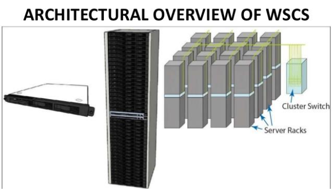
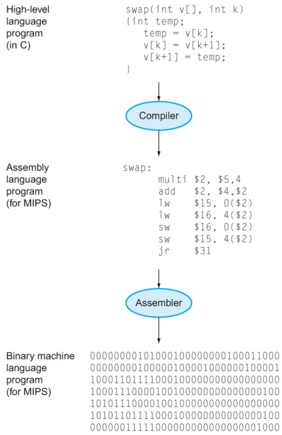
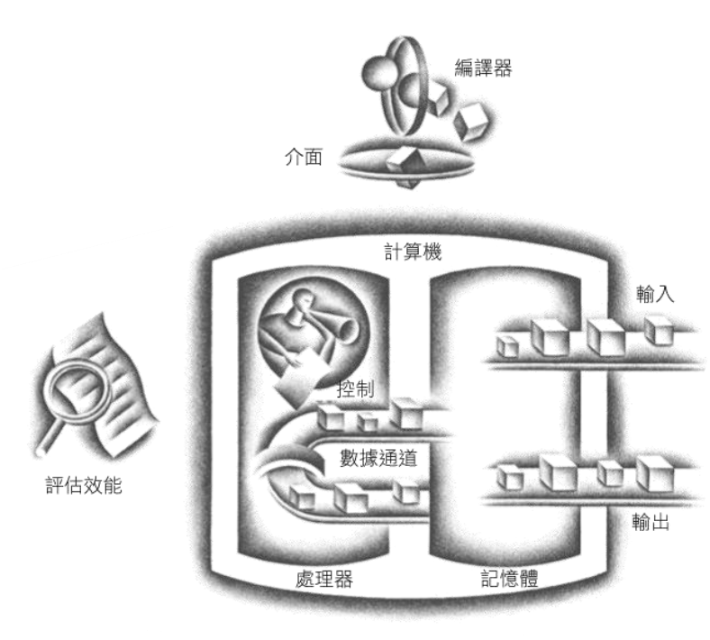
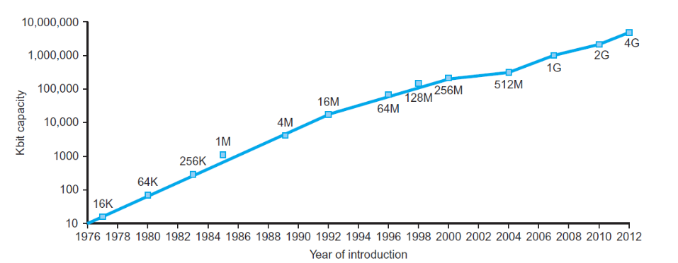
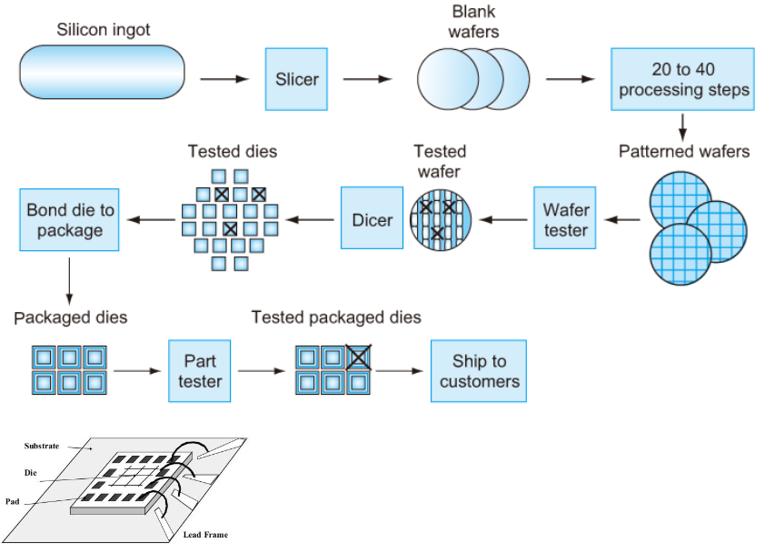
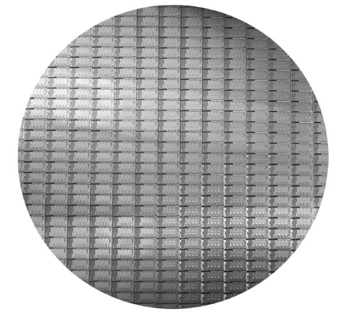
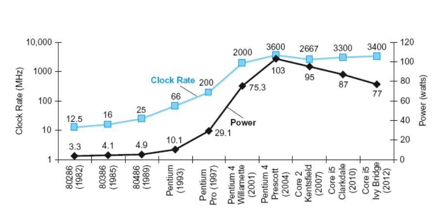
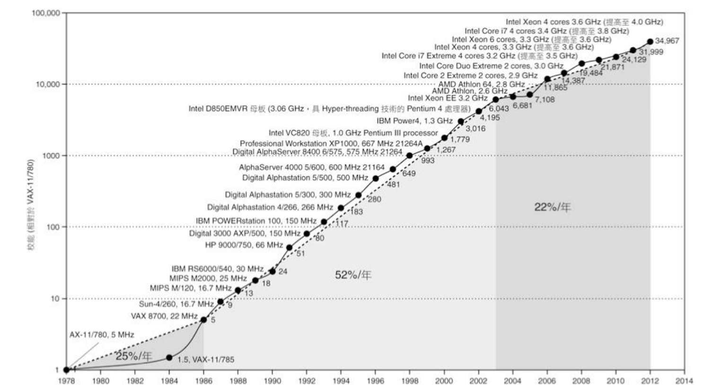

# Computer Architecture notes

collect and note by : JingShing

# 

Chapter 1

## Dialog目錄

[1.1 介紹](#1-1-Abstraction)

[1.2 計算機架構中的八大理念](#1-2-Eight-Great-ideas-of-Computer-Architecture)

[1.3 你的程式之下](#1-3-Below-Your-Program)

[1.4 覆蓋之下](#1-4-Under-the-Covers)

[1.5 建構處理器與記憶體的技術](#1-5-How-to-build-a-processor-and-a-ram)

[1.6 效能](#1-6-Performance)

[1.7 功耗障壁](#1-7-The-Power-Wall)

[1.8 巨變：由單處理器轉移至多處理器](#1-8)

1.9 實例：測試Intel core i7

1.10 謬誤與陷阱

## 1-1 Abstraction

* 計算機抽象化(Abstraction)
  * 以精要的形式來表達計算機的內涵、概念、特質、屬性或意義等，這個從計算機本身找出這個精要的形式的過程就是計算機抽象化。

* 計算機是極為快速變化的資訊科技工業中的產物

  * 如果運輸業有計算機工業的進展速度，今天我們將大約可以花幾分錢以一秒從紐約到倫敦。

  * 這個不尋常的工業以令人驚異的速度接納創意

### 計算應用的種類與它們的特性

大體而言，計算機被運用在三個不同種類的應用：

* 個人型計算機(Personal computers, PCs)

  * 強調以<u>**低成本**</u>提供單一使用者不錯的效能並能執行其他公司的軟體

* 伺服器(servers)

  是昔日大型主機、迷你計算機及超級電腦的現代版，通常經由網路來使用

  * 提供計算及輸出入容量上更大的擴充性
  * 也強調可靠度
  * Range from small servers to building sized

* 嵌入式計算機(embedded computers)

  在應用與效能的範圍最廣

  * 設計來執行單一應用或一組相關的應用，該等應用一般與硬體整合在一起，以單一系統型態呈現

  * 大部分使用者從不知道他們正在使用這類計算機通常有其獨特的應用需求以及最低效能和嚴格的成本與功耗限制

  * 通常更不能容忍失效

  * 經由簡單化或冗餘(redundancy)技術來達成

  > 冗餘(redundancy) : 利用多個 mcu 做溝通，作為備用
  > mcu : memory + cpu + io
  >
  > examples : 車載電腦、物聯網

### 進入後個人電腦時代

* 個人行動裝置(personal mobile device, PMD)由電池驅動、無線聯線至網際網路且一般售價為數百美元

  * 和個人電腦一樣，使用者可於其上執行可下載的軟體(“apps”)
  * 可能使用觸控螢幕甚或語言輸入

* 庫房規模計算機(Warehouse Scale Computers, WSCs)

  * Scalable可擴充

  * Distributed可分散

  * Cost efficiency

    > 單一硬盤損毀時可還原資料，資料會備份到多個硬盤

  ​	

  雲端計算(Cloud Computing)

  * 軟體寫作者常常會將他們的應用程式一部分執行於個人行動裝置上而一部分執行於雲端

  > 相較於雲端計算，本地的計算稱為邊緣計算(local)。

  ### 本教科書中內容

  * 在1960及1970年代，計算機的效能主要受限於其記憶體的大小
  * 現在重視效能的程式師需要瞭解，處理器的平行本質以及記憶體的階層性本質
    * 程式師於是必須增加他們的計算機組織知識
  * 本書能回答以下問題：
    * 以高階語言如C 或Java 所寫的程式如何被翻譯成硬體的語言，以及硬體如何執行這個硬體語言的程式？
  * 硬體與軟體的介面與關聯是什麼，以及軟體如何指使硬體來執行所需的功能？
  * 什麼因素決定程式的效能，以及程式如何可改善其效能？
  * 硬體設計師可用以改善效能的技術有哪些？
  * 最近由循序處理轉為平行處理的理由以及結果是什麼？
  * 自從第一台商用計算機在1951 年面世以來，計算機架構師提出過哪些奠定現代計算基礎的大理念？

  ### 瞭解程式效能

  * 下表歸納了硬體及軟體如何影響效能

  | 硬體或軟體元件                | 該元件如何影響效                           | 能該主題見於何處？ |
  | ----------------------------- | ------------------------------------------ | ------------------ |
  | 演算法                        | 決定了原始碼行數及執行的輸入∕輸出動作數    | 其他書本！         |
  | 程式語言、編譯器、與架構      | 決定原始碼中每一敘述句對應的計算機指令數目 | 第二及三章         |
  | 處理器與記憶體系統            | 決定指令可以被執行得多快                   | 第四、五及六章     |
  | 輸入∕輸出系統(硬體與作業系統) | 決定輸入∕輸出動作可能被執行得多快          | 第四、五及六章     |

## 1-2 Eight Great ideas of Computer Architecture

1. 配合摩爾定律作設計
   * 該定律指出：**IC 容量於每18 至24 個月即加倍**

2. 用抽象化來簡化設計

   * 一個硬體與軟體的抽象化(abstraction)來代表在不同層次中的設計

   * 在[電腦科學](https://zh.wikipedia.org/wiki/%E8%AE%A1%E7%AE%97%E6%9C%BA%E7%A7%91%E5%AD%A6)中，抽象化是將資料與程式，以它的語意來呈現出它的外觀，但是隱藏起它的實作細節。一個電腦系統可以分割成幾個[抽象層](https://zh.wikipedia.org/wiki/%E6%8A%BD%E8%B1%A1%E5%B1%A4)（Abstraction layer），使得程式設計師可以將它們分開處理。

3. 使經常的情形變快
4. 經由平行性提升效能
5. 經由管道處理(pipelining)提升效能
6. 經由預測(prediction)提升效能
7. 記憶體的階層(hierarchy of memories)程式設計師希望記憶體要容量大、速度快且價廉
8. 經由冗餘(redundancy)提升可靠性

## 1-3 Below Your Program

* 計算機中的硬體僅能執行極為簡單的低階指令

* 從複雜的應用落實到這些簡單硬體指令，過程中牽涉到許多層的軟體以直譯(interpret)或翻譯(translate)高階動作成為簡單計算機指令

* 系統軟體有許多種類，然而現在每一個計算機中最重要的有兩類：

  1. 作業系統(operating system)

  2. 編譯器(compiler)

圖1.3 以硬體為中心而應用軟體在最外的同心圓表示的簡化硬體軟體階層圖在複雜的應用情形下，也常會用到多層的應用軟體。

### 由高階語言到硬體的語言

* 計算機硬體的字母僅有兩個，為二進制數元(binary digit)或位元(bit)

* 計算機受的命令──稱之為指令(instruction)

* 組譯器(assembler)將一道以符號(symbol)表示的指令翻譯成二進形式

  ​	add A,B $\Rightarrow$ 1000110010100000

* 高階程式語言(high-levelprogramming languages)、組合語言(assembly language)與機器語言(machine language)，圖1.4 表示該等程式與語言間的關係

圖1.4 C程式編譯成組合語言再組譯成二進制機器語言。雖然由高階語言轉譯成二進制機器語言在此表示為兩個步驟，有些編譯器省去中間過程而直接產出二進制機器語言。這些語言以及這個程式將在第二章中有更深入的討論

## 1-4 Under the Covers

* 所有計算機內的硬體都執行以下的基本功能：
  1. 輸入資料
  2. 輸出資料
  3. 處理資料
  4. 儲存資料
* 計算機的五大傳統標準要件是輸入、輸出、記憶體、數據通道(data path)以及控制，而最後兩項有時會併稱為處理器。

圖1.5 表示出五大標準要件的計算機組織處理器由記憶體取得指令與資料。輸入將資料寫入記憶體，而輸出由記憶體讀取資料。控制送出決定數據通道、記憶體、輸入和輸出應如何運作的訊號

## 1-5 How to build a processor and a ram

* 表格表示過去不同時期所使用的技術，並對每一種技術估計其單位成本的對應效能

| 年度 | 計算機使用的技術                  | 相對的效能∕單位成本 |
| ---- | --------------------------------- | ------------------- |
| 1951 | 真空管(vacuum tube)               | 1                   |
| 1965 | 電晶體                            | 35                  |
| 1975 | 積體電路                          | 900                 |
| 1995 | 超大型積體電路                    | 2,400,000           |
| 2013 | 極大型(Ultra large-scale)積體電路 | 250,000,000,000     |

不同年代計算機中所使用技術的每單位成本的相對效能。

> 資料來源：Computer Museum，美國Boston，而2013 年的數據是由作者依外插的方式得出

* 圖1.11 表示動態隨機記憶體容量自1977年以來的增長

​											圖1.11 DRAM 晶片容量隨著時間的成長曲線

y 軸以kbits(210bits)作為單位。DRAM 業界在過去20年來幾乎每三年就將容量提高四倍，也就是每年提升60%。近年來，這個增加速度已經緩慢下來，漸漸變成約略每兩年到三年才將容量加倍

* 圖1.12 表示積體電路製程
* **！！！重要！！！**

> Silicon ingot : 矽碇
>
> Blank wafers : 空白晶圓
>
> Patterned wafers : 光蝕刻後的晶圓
>
> Dicer : 切割
>
> Dies : 晶粒

圖1.12 晶片的製造過程空白晶圓從矽碇切片下來後，經過20 到40 道步驟後成為作好電路的晶圓(見圖1.13)。之後這些作好電路的晶圓經過晶圓測試機測試以產生良好部分的對照圖。之後晶圓被切割成晶粒(見圖1.9)。本圖中，一片晶圓產出20 個晶粒，其中17 個通過測試(×表示晶粒損壞)。本例中良好晶粒的良率(產出率(良率)，yield)是17/20或85%。這些好的晶粒接著被連結在封裝中並於出貨給顧客之前再作一次測試。在這個最後的測試中又發現一個壞掉的封裝好的零件

### Intel Core i7 Wafer

* 300mm wafer(12吋), 280 chips, 32nm technology
* Each chip is 20.7 x 10.5 mm24

### Integrated Circuit Cost

$Cost ~ per ~ die=\frac{Cost ~ per ~ die}{Dies ~ per ~ die\times Yield}$

$Dies ~ per ~ wafer \approx \frac {Wafer ~ area}{Die ~ area}$

$Yield=\frac{1}{(1+(Defects ~ per ~ area\times Die ~ area/2))^2}$

* Nonlinear relation to area and defect rate
  * Wafer cost and area are fixed
  * Defect rate determined by manufacturing process
  * Die area determined by architecture and circuit design

## 1-6 Performance

* Response time(反應時間)
  * How long it takes to do a task
* Throughput(處理量)
  * Total work done per unit time
    * e.g., tasks/transactions/... per hour
* 個人關心的是降低response time──一件工作由開始至結束的時間，亦稱為執行時間(execution time)
* 數據中心管理員則常關心處理量(throughput)或頻寬(bandwidth)在給定時間內所完成的工作量

### 處理量與反應時間

以下對計算機系統的改變可否提昇處理量、降低反應時間或兼得？

1. 以較快的處理器置換於計算機中
2. 在使用多個處理器來分別處理各個工作──例如在全球資訊網中搜尋──的系統中加入額外的處理器

* 降低反應時間幾乎永遠可提升處理量。因此在情況1 中，反應時間及處理量均獲改善。在情況2 中，沒有任何工作可更快完成，故僅處理量有提昇
* 當情況2 中，處理量需求大增時，可能造成系統將工作需求貯存起來。在這種情況下，由於增加處理量可降低工作需求在貯列中的等待時間，故可同時改善反應時間。

### Relative Performance

* Define Performance = 1/Execution Time

* “X is ntime faster than Y”

  > $Performance_x/Performance_y=Execution ~ time_y/Execution ~ time_x$
  >
  > * Example: time taken to run a program
  >   * 10s on A, 15s on B
  >     * Elapsed timeTotal response time, including all aspectsProcessing, I/O, OS overhead, idle timeDetermines system performanceCPU timeTime spent processing a given jobDiscounts I/O time, other jobs’ sharesComprises user CPU time and system CPU timeDifferent programs are affected differently by CPU and system performance$Execution ~ Time_B/ Execution\:Time_A= 15s / 10s = 1.5$
  >     * So A is 1.5 times faster than B

### Measuring Execution Time測量運行時間

* Elapsed time經過時間
  * Total response time, including all aspects
    * Processing, I/O, OS overhead, idle time
  * Determines system performance
* CPU time
  * Time spent processing a given job
    * Discounts I/O time, other jobs’ shares
  * Comprises user CPU time and system CPU time
  * Different programs are affected differently by CPU and system performance

> 22/9/14

### CPU Clocking

> $m\rightarrow -3$ $\quad k\rightarrow 3$
>
> $\mu\rightarrow -6$$\quad M\rightarrow 6$
>
> $n\rightarrow -9$$\quad G\rightarrow 9$
>
> $p\rightarrow -12$$\quad T\rightarrow 12$

* Operation of digital hardware governed by a constantrate clock

* Clock period時脈週期: duration of a clock cycle時脈週期

  > Clock period 和 Clock cycle 翻譯皆為時脈週期。

  *  e.g., $250ps = 0.25ns = 250×10^{–12}s$

* Clock frequency (rate): cycles per second 

  * e.g., $4.0GHz = 4000MHz = 4.0×10^9Hz$

### CPU Time

$CPU ~ Time=CPU ~ Clock ~ Cycles\times Clock ~ Cycle ~ Time=\frac{CPU ~ Clock ~ Cycles}{Clock ~ Rate}$

* Performance improved by 

  * Reducing number of clock cycles 

    減少時脈周期的數量

  * Increasing clock rate

    增加時脈頻率/時脈速率

  * Hardware designer must often trade off clock rate against cycle count

    硬體設計師應該權衡(妥協)時脈頻率和時脈週期。

### CPU Time Example範例

* Computer A: 2GHz clock, 10s CPU time 

* Designing Computer B 

  * Aim for 6s CPU time

    目標6秒CPU time

  * Can do faster clock, but causes 1.2 × clock cycles

* How fast must Computer B clock be?

$Clock ~ Rate_b=\frac{Clock ~ Cycles_b}{CPU ~ Time_b}=\frac{1.2\times Clcock ~ Cycles_A}{6s}$

$Clock ~ Cycles_A=CPU ~ Time_A\times Clock ~ Rate_A=10s\times2GHz=20\times10^9$

$Clock ~ Rate_B=\frac{1.2\times20\times10^9}{6s}=\frac{24\times10^9}{6s}=4GHz$

### Instruction Count and CPI

$Clock ~ Cycles=Instruction ~ Count\times Cycles ~ per ~ Instruction$

$CPU ~ Time=Instruction ~ Count\times CPI\times Clock ~ Cycle ~ Time=\frac{Instruction ~ Count\times CPI}{Clock ~ Rate}$

> ISA(Instruction Set Architecture；指令集架構)

* Instruction Count for a program 
  * Determined by program, ISA and compiler 
* Average cycles per instruction 
  * Determined by CPU hardware 
  * If different instructions have different CPI 
    * Average CPI affected by instruction mix

### CPI Example

一個程式在不同的電腦執行

* Computer A: Cycle Time = 250ps, CPI = 2.0 
* Computer B: Cycle Time = 500ps, CPI = 1.2 
* Same Instruction count 
* Which is faster, and by how much?

$CPU ~ Time=Instruction ~ Count\times CPI\times Cycle ~ Time$

$CPU ~ Time_A=I\times 2.0\times 250ps=I\times 500ps$

$CPU ~ Time=Instruction ~ Count\times CPI\times Cycle ~ Time$

$CPU ~ Time_B=I\times 1.2\times 500ps=I\times 600ps$

$Since ~ 500 ~ is ~ \le 600 ~ so ~ A ~ is ~ faster ~ than ~ B$

$\frac{CPU ~ Time_B}{CPU ~ Time_A}=\frac{I\times 600ps}{I\times 500ps}=1.2$

$By ~ 1.2 ~ times ~ faster$

### CPI in More Detail

* If different instruction classes take different numbers  of cycles

$Clock ~ Cycles=\sum_{i=1}^{n}(CPI_i\times ~ Instruction ~ Counts_i)$

* Weighted average CPI

$CPI=\frac{Clock ~ Cycles}{Instruction ~ Count}=\sum_{i=1}^{n}(CPI_i\times\frac{Instruction ~ Count_i}{Instruction ~ Count})$

$\frac{Instruction ~ Count_i}{Instruction ~ Count}\Rightarrow Relative frequency$

### CPI Example

相同程式用不同編譯器，在相同電腦執行

* Alternative compiled code sequences using  instructions in classes A, B, C

  *  IC :Instruction count

  | Class             | A    | B    | C    |
  | ----------------- | ---- | ---- | ---- |
  | CPI  for class    | 1    | 2    | 3    |
  | IC  in sequence 1 | 2    | 1    | 2    |
  | IC  in sequence 2 | 4    | 1    | 1    |

  * Sequence 1: IC = 5 
    * Clock Cycles = 2×1 + 1×2 + 2×3 = 10 
    * Avg. CPI = 10/5 = 2.0
  * Sequence 2: IC = 6 
    * Clock Cycles = 4×1 + 1×2 + 1×3 = 9 
    * Avg. CPI = 9/6 = 1.5

### Performance Summary

#### The BIG Picture

$CPU ~ Time=\frac{Instruction}{Program}\times \frac{Clockcycles}{Instruction}\times\frac{Seconds}{Clock ~ Cycle}$

* Performance depends on 
  * Algorithm: affects IC, possibly CPI 
  * Programming language: affects IC, CPI 
  * Compiler: affects IC, CPI 
  * Instruction set architecture: affects IC, CPI, Tc

### 瞭解程式效能

* 一個程式的效能與演算法、語言、編譯器、架構以及實際的硬 體有關

  

  * 有些處理器每時脈週期擷取及執行多道指令
    * 有些設計者倒轉CPI 以表為IPC，或每時脈指令 數。 
    * 若某處理器平均每時脈執行二道指令，則其具 有IPC=2 亦即CPI=0.5 
  * 為了省能或是短暫地加強效能，現在的許多處理 器可以變化它們的時脈速率，因此我們對一個程 式會需要知道其平均的時脈速率

## 1-7 The Power Wall

* 功耗形成了冷卻能力的最低要求 

* 對能源而言焦耳這個能量單位比譬如瓦數的耗能率更為恰當 

  * 所消耗的電能，稱為電功率，其單位為瓦特（watt，簡寫為W），簡 稱瓦。 ◎如果有1安培的電流通過1伏特的電位差，則每秒內所獲得或 消耗的能量為1焦耳，或者說電功率為1瓦特，即「1瓦特＝1焦耳 ∕ 秒」 ，或「1W＝1J ∕ s」。 

* 每個電晶體 0/1 轉換一次的動態能耗是 

  $能耗 ∝ \frac12 × 電容性負載×電壓^2$

* 每個電晶體所需功耗就是 

  $能耗 ∝ \frac12 × 電容性負載×電壓^2 × 切換頻率$

### Power Trends

* In CMOS IC technology

$Power=Capacitiveload\times Voltage^2\times Frequency$

> $Power\Rightarrow \times30$
>
> $Voltage^2\Rightarrow5V\rightarrow1V$
>
> $Frequency\Rightarrow \times1000$

###  The Power Wall 功耗障壁

* 一般電壓在每個新世代中下降大約15% 
  * 20 年來，電壓已從5V 降到1V 
* 今日的問題是更加降低電壓將會使得電晶體漏電太多 
  * 甚至於今天電耗中已有40% 來自於漏電 
* 兩個理由使功耗成為積體電路設計的難題 
  1. 功耗必須由外部引入且分送至晶片各處 
  2. 功耗以熱的形式消散然後必須被移除

## <a name="1-8">1-8 The Sea Change: The Switch from Uniprocessors to Multiprocessors

* 圖1.17 顯示桌上型微處理器在程式反應時間上隨著 年代的改善 
  * 2002 年起改善速率減緩 
* 2006 年時所有桌上型及伺服器公司都推出每一晶片 具有多個處理器的微處理器 
  * 其所帶來在處理量上的好處更甚於反應時間，稱 處理器為內核 
  * 稱這種微處理器為多核微處理器

圖1.17 自1980 年代中期以來的處理器效能增進情形

這個表描繪出以SPECint 測試程式(見1.10 節)測得的相對於VAX 11/780 的效能。在1980 年代中期 以前，處理器效能增進的動力主要是來自半導體技術，並且平均每年提升約25%。之後增進的速度 提高到大約52%則是受惠於更為進步的架構與組織的觀念。這個自1980 年代中期以來更高的52%  效能增進表示：較之如果維持了每年25% 的效能增進的話，到了2002 年效能又多高出了七倍。自 從2002 年以來，功耗造成的各種限制、可用的指令階層平行度以及相對很長的記憶體延遲減緩了邇 來的單一處理器效能增進，到了約略每年祇有22% 的增進

* 今天，程式師如欲獲致重大的時間改善，則需要重 新編程以善用多個處理器 
* 為什麼寫作明確的平行程式這麼難？ 
  * 第一個理由是追求效能的程式寫作其困難度增加 
  * 第二個理由是程式師必須分割一個應用以使每個 處理器同時可以擁有大約相同的工作量，以及排 程和協調所造成的額外花費不致於抵銷掉平行性 帶來的潛在效能好處 
    * 均勻地平衡負載(balance the load) 
    * 降低通訊與同步的額外花費(reduce communication and  synchronization overhead)

> 22/9/21

