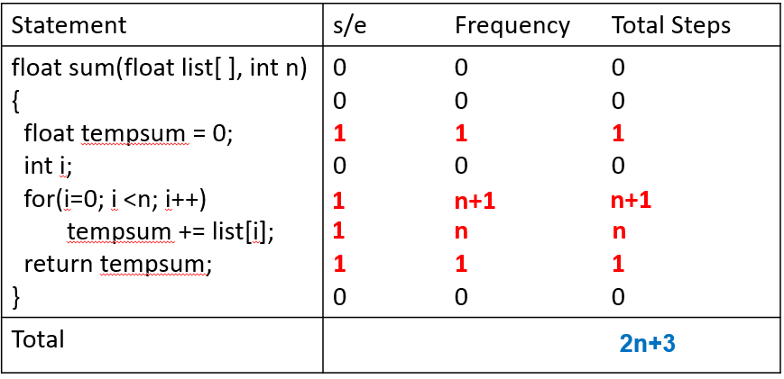

collect and note by JingShing

# Data Structure in C

## Dialog目錄

* [CHAPTER 1 BASIC CONCEPT](#CHAPTER-1-BASIC-CONCEPT)

## 資料結構

* 教學目標：

  資料結構主要是在研究如何把原始資料透過組織安排，存放到電腦中的一門學問，資料結構之目的亦在於如何有效撰寫程式。為了了解資料結構對於程式之影響，我們將使用C程式語言作為了解資料結構觀念之基本工具。因此，C語言程式之寫作基本觀念不可或缺。

* 教科書

  "Fundamentals of Data Structures in C", 2nd edition, by Horowitz et al.

## CHAPTER 1 BASIC CONCEPT

### Outline

* [**Overview : System Life Cycle(系統生命週期)**](#System-Life-Cycle)

* [Algorithm Specification(演算法定義)](#Algorithm-Specification)

* [Data Abstraction(資料抽象化)](#Data-Abstraction)

* [Performance Analysis(效率分析)](#Performance-Analysis)

* Performance Measurement(效率測量)

### System Life Cycle

* Requirements (需求）
  * 例如：定義專案目標、輸入是什麼、輸出是什麼
* Analysis (分析）: bottom-up vs. top-down
  * bottom-up: 比較沒有結構化與整體的計劃
  * top-down: 根據程式最後的目標，將程式分割成數個片段
* Design(設計) : data objects (物件) and operations (運算)
  * 例如：(物件) 學生、成績、教授；(運算) 新增課程、搜尋課程
* Refinement and coding(改良與編碼) 
* Verification(驗證) 
  * Correctness proofs (例如：數學証明)
  * Testing (例如：用switch指令測試每一種狀況)
  * Error removal (例如：利用前兩項與說明文件輔助除錯)

### Algorithm Specification

* Definition: An algorithm is a finite set of instructions that accomplishes a particular task.(有限個指令的集合,可完成一項特定工作)
* Criteria
  * Input(輸入): zero or more quantities
  * Output(輸出): at least one quantity is produced
  * Definiteness(明確的): each instruction is clear and unambiguous
  * Finiteness(有限的): terminate after a finite number of steps
  * `Effectiveness`(有效率的): instruction is basic enough to be carried out by a person using only pencil and paper

### Example 1.1

* Selection Sort (選擇排序法): sort a set of n unsorted integers.
* Solution: find the smallest and place it next in the sorted list
* However, the describe is not an algorithm, because it do not tell us
  * How the integers are initially stored
  * Where we should place the result

### Program 1.2: Selection sort algorithm

* Selection Sort (選擇排序法): sort a set of n unsorted integers.

* Assume: integers are stored in an array, list, such that the ith integer is stored in the ith position, list[i].

* Algorithm:

  ```c
  for( i = 0; i < n ; i++ ) {    
      Examine list [i] to list[n 1] and suppose that the    
      smallest integer is at list [min];     
      Interchange list[i] and list [min];
  }
  ```

  #### An example for selection sort

  <center>sample list


  | *i*  | [0]  | [1]  | [2]  | [3]  | [4]  | [5]  | [6]  | [7]  | [8]  |
  | ---- | ---- | ---- | ---- | ---- | ---- | ---- | ---- | ---- | ---- |
  |      | 14   | 7    | 2    | 20   | 13   | 31   | 17   | 25   | 36   |
  | 0    | 2    | 7    | 14   | 20   | 13   | 31   | 17   | 25   | 36   |
  | 1    | 2    | 7    | 14   | 20   | 13   | 31   | 17   | 25   | 36   |
  | 2    | 2    | 7    | 13   | 20   | 14   | 31   | 17   | 25   | 36   |
  | 3    | 2    | 7    | 13   | 14   | 20   | 31   | 17   | 25   | 36   |
  | 4    | 2    | 7    | 13   | 14   | 17   | 31   | 20   | 25   | 36   |
  | 5    | 2    | 7    | 13   | 14   | 17   | 20   | 31   | 25   | 36   |
  | 6    | 2    | 7    | 13   | 14   | 17   | 20   | 25   | 31   | 36   |
  | 7    | 2    | 7    | 13   | 14   | 17   | 20   | 25   | 31   | 36   |
  | 8    | 2    | 7    | 13   | 14   | 17   | 20   | 25   | 31   | 36   |

### Program 1.4: Program of Selection Sort

```c
#include <stdio.h>
#include <math.h>
#define MAX_SIZE 101
#define SWAP(x, y, t) ((t) = (x), (x) = (y), (y) = (t))
void sort(int [], int );  /*選擇排序*/
void main(void){
	int i, n;	
	int list[MAX_SIZE];
    printf(“Enter the number of numbers to generate: “);
    scanf(“%d”, &n);
    if( n < 1 || n > MAX_SIZE){
        fprintf(stderr, “Improper value of n\n”);        
        exit(EXIT_FAILURE);
	}
	for(i = 0; i < n ; i++) {  /*隨機產生數值*/
        list[i] = rand( ) % 1000;
 printf(“%d “,list[i]);
 }
void sort(int list[], int n)
{
   int i, j, min, temp;
   for(i = 0; i < n ; i++)  {
      min = i;
      for(j = i+1 ; j < n ; j++) 
        if(list[j] < list[min])
          min = j;
      SWAP(list[i],list[min],temp);
   }
}
```

### Example 1.2: Binary Search Is the integer searchnum in this list?

* Program 1.5 Searching a sorted list

* Algorithm:

  ```c
  while (there are more integers to check) {     
      middle  =  (left  +  right)  /  2;      
      if (searchnum < list[middle])                 
          right  =  middle  -  1;     
      else  if  (searchnum  ==  list[middle])                 
          return  middle;     	
      else  left   =  middle  +  1; 
  }
  ```

###  An example for binary search

Searchnum = 29

| i    | [0]  | [1]  | [2]  | [3]  | [4]  | [5]  | [6]  | [7]  | [8]  | [9]  | [10] | [11] | [12] | [13] | [14] |
| ---- | ---- | ---- | ---- | ---- | ---- | ---- | ---- | ---- | ---- | ---- | ---- | ---- | ---- | ---- | ---- |
|      | 3    | 11   | 15   | 20   | 23   | 29   | 31   | 35   | 36   | 43   | 47   | 49   | 50   | 53   | 56   |
|      | 3    | 11   | 15   | 20   | 23   | 29   | 31   | 35   | 36   | 43   | 47   | 49   | 50   | 53   | 56   |
|      | 3    | 11   | 15   | 20   | 23   | 29   | 31   | 35   | 36   | 43   | 47   | 49   | 50   | 53   | 56   |

Searchnum = 43

| i    | [0]  | [1]  | [2]  | [3]  | [4]  | [5]  | [6]  | [7]  | [8]  | [9]  | [10] | [11] | [12] | [13] |
| ---- | ---- | ---- | ---- | ---- | ---- | ---- | ---- | ---- | ---- | ---- | ---- | ---- | ---- | ---- |
|      | 3    | 11   | 15   | 20   | 23   | 29   | 31   | 35   | 36   | 43   | 47   | 49   | 50   | 53   |
|      | 3    | 11   | 15   | 20   | 23   | 29   | 31   | 35   | 36   | 43   | 47   | 49   | 50   | 53   |
|      | 3    | 11   | 15   | 20   | 23   | 29   | 31   | 35   | 36   | 43   | 47   | 49   | 50   | 53   |
|      | 3    | 11   | 15   | 20   | 23   | 29   | 31   | 35   | 36   | 43   | 47   | 49   | 50   | 53   |

### Program 1.7: Searching an ordered list

```c
    #define COMPARE(x,y) (((x) < (y)) ? -1: ((x) == (y))? 0:1)
    int binsearch(int list[], int searchnum, int left, int right){   
    /* searching list[0] <= list[1] <= … <= list[n-1] for         
    searchnum . Return its position if found. Otherwise         
    return  -1 */      
    int middle;       
    while (left <= right) {             
        middle = (left + right)/2;            
        switch (COMPARE(list[middle], searchnum)) {                  
            case -1: left = middle + 1;                   
            case 0 : return middle;                   
            case 1 : right = middle – 1;             
        }      
    }        
    return -1; 
	}
```

### Recursive Algorithms(遞迴演算法)

* We should express a recursive algorithm when the problem itself is defined recursively(當問題本身以遞迴方式定義).
  * extremely powerful (可讓我們用定義解決問題)
  * frequently allow us to express an otherwise complex process in very clear term (經常可讓我們用清楚的方式描述一個複雜問題)
* Example : $\dbinom{n}{m}=\left( \frac{n!}{m!(n-m!)} \right) \quad\dbinom{n}{m}=\dbinom{n-1}{m}+\dbinom{n-1}{m-1}$

* Direct recursion(直接遞迴)：functions can call themselves
* Indirect recursion(間接遞迴)：functions may call other functions that invoke the calling function again

### Program 1.8:Recursive Implementation of Binary Search

```c
int binsearch (int list[], int searchnum, int left, int right){     
    /* search list[0]<=list[1]<=…<=list[n-1] for searchnum. Return its
           position if found. Otherwise return -1 */
       int middle;
       if (left <= right) { 
            middle = (left + right)/2;
            switch (COMPARE(list[middle], searchnum)) {
                case -1: return binsearch(list, searchnum, middle + 1, right);
                case 0 : return middle;
                case 1 : return binsearch(list, searchnum, left, middle – 1);
         }
    }
    return -1;
}
```

### Comparison of the two programs

Program 1.7: Searching an ordered list

```c
    #define COMPARE(x,y) (((x) < (y)) ? -1: ((x) == (y))? 0:1)
    int binsearch(int list[], int searchnum, int left, int right){   
    /* searching list[0] <= list[1] <= … <= list[n-1] for         
    searchnum . Return its position if found. Otherwise         
    return  -1 */      
    int middle;       
    while (left <= right) {             
        middle = (left + right)/2;            
        switch (COMPARE(list[middle], searchnum)) {                  
            case -1: left = middle + 1;                   
            case 0 : return middle;                   
            case 1 : right = middle – 1;             
        }      
    }        
    return -1; 
	}
```

Program 1.8:Recursive Implementation of Binary Search

```c
	int binsearch (int list[], int searchnum, int left, int right){     
    /* search list[0]<=list[1]<=…<=list[n-1] for searchnum. Return its
           position if found. Otherwise return -1 */
       int middle;
       if (left <= right) { 
            middle = (left + right)/2;
            switch (COMPARE(list[middle], searchnum)) {
                case -1: return binsearch(list, searchnum, middle + 1, right);
                case 0 : return middle;
                case 1 : return binsearch(list, searchnum, left, middle – 1);
         }
    }
    return -1;
}
```

## Data Abstraction

* Data Type(資料型態)

  * A data type is a collection of **objects** and a set of **operations** that act on those objects.(**物件**的集合和可以在這些物件上**運算**的集合)

  * Example. 

    ​	The data type int consists of the objects {0, +1, -1, +2, -2, …, INT_MAX, INT_MIN} and the operations +, -, *, /, and %.

* The data types of C

  * The **basic** data types: char, int, float and double
  * The **group** data types: array and struct
  * The **pointer** data type
  * The **user-defined** types

* **Abstract Data Type :** An abstract data type (ADT) is a data type that is organized in such a way that the specification of the objects and the operations on the objects is separated from the representation of the objects and the implementation of the operations.
  (一種資料型態, 它的組織方式使得**物件的規格**與物件上**可作哪些運算**，**與物件的表示法與運算的實作法是獨立的**)

* We know what it does, but not necessarily how it will do it.

  | **specification  of the objects** |
  | --------------------------------- |
  | specification  of the operations  |

  ---

  | **representation  of the objects** |
  | ---------------------------------- |
  | implementation  of the operations  |

### ADT : NaturalNumber

**ADT** NaturalNumber is
   **objects**: an ordered subrange of the integers **starting at zero and ending
           at the maximum integer (INT_MAX)** on the computer
   **functions**:
    for all x, y Î Nat_Number; TRUE, FALSE Î Boolean
    and where +, -, <, and == are the usual integer operations.

| **NaturalNumber** **Zero(  )**         | ::=  0                                                       |
| -------------------------------------- | ------------------------------------------------------------ |
| **Boolean**  **IsZero**(x)             | ::=  **if** (  x ) return FALSE       **else**  return  TRUE |
| **Boolean**  **Equal(x, y)**           | ::=  **if** (x = = y) return TRUE     **else** return FALSE  |
| **NaturalNumber** **Successor(x****)** | ::=  **if** (x = = INT_MAX) return x   **else** return x + 1 |
| **NaturalNumber** **Add(x, y)**        | ::=  **if** ( x + y <= INT_MAX) return x + y   **else** return INT_MAX |
| **NaturalNumber** **Subtract(x, y)**   | ::=  **if** ( x < y ) return 0    **else** return x－y       |

**end** NaturalNumber

### Operation Specification

* Operation specification 

  * function name
  * the types of arguments
  * the type of the results

* Example:
  for all x, y $\in$ Nat_Number; TRUE, FALSE $\in$ Boolean

  Boolean Equal(x, y)   ::=        **if** (x== y) **return** TRUE
                                                **else return** FALSE

## Performance Analysis

* There are many criteria upon which we judge a program, including (評估程式的標準)
  * Meet the original specifications?
  * Work correctly?
  * Contain documentation?
  * Functions work effectively?
  * Is code readable?
  * Efficiently use storage?
  * Is running time acceptable?
  * ...
* Performance Analysis (machine independent)
* Space complexity(空間複雜度): the amount of memory that it needs to run to completion (執行程式時所需的記憶體)
* Time complexity(時間複雜度): computing time
  Performance Measurement (machine dependent)(效率測量)

## Space Complexity  :  $S(P)= c + SP(I)$**(空間複雜度)**

* Fixed Space Requirements (*c*) (固定的空間需求)

  * Independent of the characteristics of the inputs and outputs (與輸出輸入的數量大小**無關**)

    * instruction space (指令空間,儲存程式碼的空間)

    * space for simple variables, fixed-size structured variable, constants (簡單變數,大小固定的結構變數和常數所需的空間)

* Variable Space Requirements (*S**P*(*I*)) (變動的空間需求)

  * depend on the instance characteristic I
    (與實際問題 *I* 的特性**相關**)

  * values of inputs and outputs associated with I
    (常用的特性為 *I* 的輸出與輸入數量)

## Program 1.10: Simple arithmetic function

* float abc(float a, float b, float c)
  {
   return a + b + b * c + (a + b - c) / (a + b) + 4.00;
  }

* In this program, fixed Space Requirements (*c*) = 16.

  | **Type**                                              | **Name** | **Number  of bytes** |
  | ----------------------------------------------------- | -------- | -------------------- |
  | parameter:  float  return  address: (used internally) | a,  b, c | 4 *  3 = 12  4       |

* Variable Space Requirements, $S_{abc}(I) = 0$.

## Program 1.11:  Iterative function for summing a list of numbers

* float sum(float list[ ], int n)
  {
    float tempsum = 0;
    int i;
    for (i = 0; i<n; i++)
       tempsum += list [i];
    return tempsum; 
  }

* In this program, $S_{sum}(I) = 0$

  ​	因為C傳送陣列的第一個元素的位址，不會複製陣列

## Program 1.12:  Recursive function for summing a list of numbers

* float rsum(float list[ ], int n)
  {
   if (n) return rsum(list, n-1) + list[n-1];
   return list[0];
  }

* The total variable space needed for the recursive version is $S_{rsum}(I)= 12n$. **Thus, the recursive version has a far greater overhead than its iterative counterpart.**  **(遞迴式程式較迴路式程式需要較多資源)**

  | **Type**                                                     | **Name**  | **Number  of bytes** |
  | ------------------------------------------------------------ | --------- | -------------------- |
  | parameter:  array pointer  parameter:  integer  return  address: (used internally) | list[]  n | 4  4  4              |
  | TOTAL  per recursive call                                    |           | 12                   |

## Time Complexity : $T(P)= c + T_P(I)$(時間複雜度):

* **Compile time** (編譯時間) (*c*)
  * Independent of the characteristics of the inputs and outputs 
    (與輸出輸入的數量大小無關)

  * Once the program running is verified correctly, it can run without recompilation. (一旦可正確執行, 不需重新編譯) 

* **Run time** (執行時間) (*T**P*(*I*)) : **we are really concerned**
  * *E.g.,   $ T_P(n) = c_aADD(n) + c_sSUB(n) + c_lLDA(n) + c_{st}STA(n) $
    * ADD, SUB, LDA, STA are the number of additions, subtractions, loads and stores. (執行各運算所需次數)
    * $c_a, c_s, c_l, c_{st}$ are constants that refer to the time needed to perform each operation. (執行各運算所需時間)


## Time Complexity **-** program step

* A **program step** (程式步驟) is a syntactically (語法) or semantically (語意) meaningful program segment whose execution time is independent of the instance characteristics.
  (語意或語法上有意義的程式片段, 它的執行時間和輸入數目無關)
* Example (one program step)
  * a=2
  * a = 2*b + 3*c /d – e + f /g/a/b/c
* Methods to compute the number of program steps
  (計算程式步驟數量的方法)
  * Creating a global variable, *count.*（使用全域變數)
  * Tabular method (表格法)
    * Determine the total number of program steps contributed by each statement step per **execution** $\times$ **frequency** 
      (執行一次所需的程式步驟 $\times$ 次數)
    * Add up the contribution of all statements 
      (加總)

## Program step - count statements

## Program 1.13:Program 1.11 with count statements

```
float sum(float list[ ], int n){
float tempsum = 0;     count++;	                /* for assignment */
int i;
for (i = 0; i < n; i++) {
count++;                                            	/* for the "for" loop */
tempsum += list[i];   count++;         	/* for assignment */
}
count++;                                                  	/* last execution of "for" */
count++;                                                   	/* for return */ 
return tempsum;  
}
```

Count = 2n + 3(steps)

```c
tempsum = 0;
i = 0;
tempsum += list[0];
i = 1;
tempsum += list[1];
i = 2;
tempsum += list[2];
i = 3;
return tempsum;
// if n = 3
// count = 2*3+3 = 9
```

## Program step - Tabular method

 ## Figure 1.2: Step count table for Program 1.10

<center>steps/execution




>  22/9/15

Big O
* $存在c, n_0 > 0,當n\geq n_0, f(n)\leq cg(n)$

>  22/9/22
